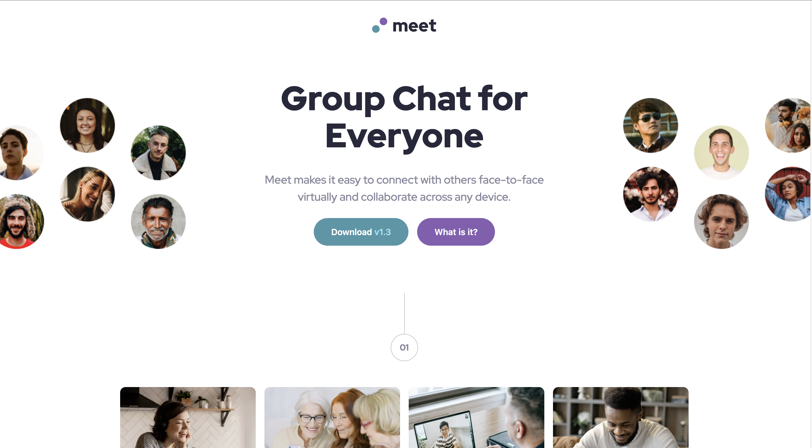

# Frontend Mentor - Meet landing page solution

This is a solution to the [Meet landing page challenge on Frontend Mentor](https://www.frontendmentor.io/challenges/meet-landing-page-rbTDS6OUR). Frontend Mentor challenges help you improve your coding skills by building realistic projects. 

### The challenge

Users should be able to:

- View the optimal layout depending on their device's screen size
- See hover states for interactive elements

### Screenshot

### Links

- Solution URL: https://github.com/norwegJan/Meet-Landing-Page
- Live Site URL: https://norwegjan.github.io/Meet-Landing-Page/

## My process

### Built with

- Semantic HTML5 markup
- CSS custom properties
- Flexbox
- CSS Grid
- Mobile-first workflow

**Note: These are just examples. Delete this note and replace the list above with your own choices**

### What I learned

Working on this challenge I felt I started to understand complex responsivness and positioning of components better. The biggest challenge for me this time was figuring out how swapping from a single image on the mobile/desktop-layouts to two images for the desktop layout. This got me thinking more in depth on whether to use the <picture> element or not, how to hide certain images for desktop only and/or mobile/tablets, and so on. I also struggled a bit on how to overlap several components/divs on top of each other, like the background image in the footer, with a color overlay over it. All in all, it was fun figuring out how to approach these challenges within this challenge 🤓👍

### Useful resources

As always, the helpfull mentors on the Discord channel as well as Kevin Powell on youtube is always my go to resources when I get stuck, or need to understand certain concepts better 🙌 

## Author

- Website - https://github.com/norwegJan
- Frontend Mentor - https://www.frontendmentor.io/profile/norwegJan

